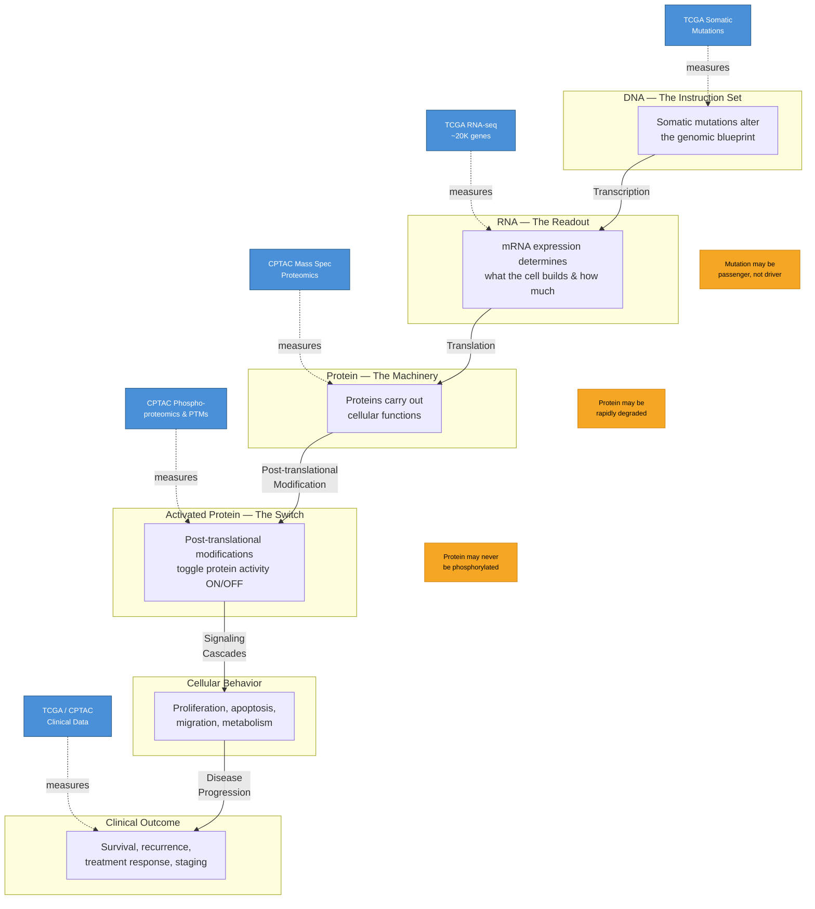
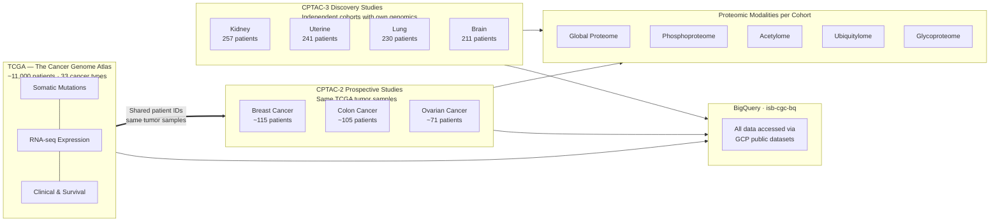
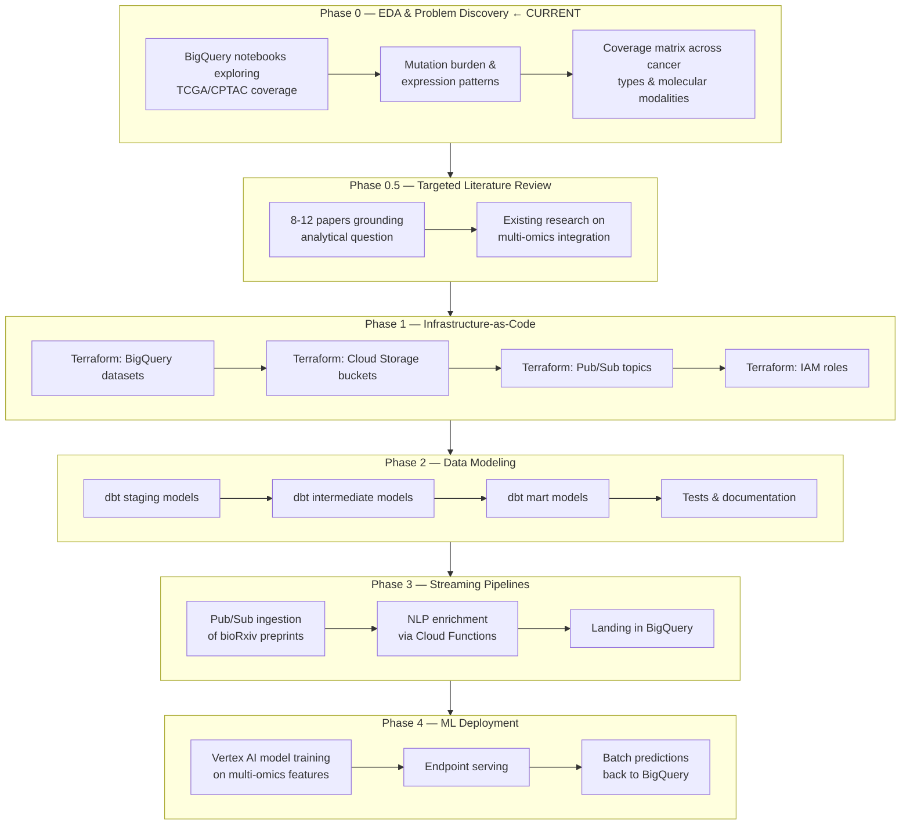

# Cancer Multi-Omics Analytics Pipeline

**From Silicon to Cytoplasm** — Tracing the flow of biological information from DNA through clinical outcomes, using multiple molecular measurement types to identify where cellular regulation breaks down in cancer.

A learning-focused portfolio project that integrates genomic, transcriptomic, proteomic, and clinical data from [TCGA](https://www.cancer.gov/ccg/research/genome-sequencing/tcga) and [CPTAC](https://proteomics.cancer.gov/programs/cptac) public datasets on Google Cloud Platform.

**Author:** Tony Leo — Technical PM and data scientist with 14 years in tech, transitioning into biomedicine.
**Portfolio:** [tonyleo.bio](https://tonyleo.bio)

---

## Why Multi-Omics?

Cancer is not a single-layer problem. A tumor's behavior emerges from the interplay of its mutated DNA, the genes it transcribes, the proteins it builds, and whether those proteins are switched on or off. No single measurement captures the full picture — but by integrating multiple molecular layers, we can trace *where* the signal breaks down.

This pipeline follows the **central dogma of molecular biology**, extended through post-translational modification to clinical outcome, and maps each public dataset to the biological layer it measures:



### The Biological Layers

| Layer | What It Is | What It Tells Us | Dataset |
|-------|-----------|------------------|---------|
| **Genome** | DNA — the instruction set | Somatic mutations show where cancer has rewritten the code | TCGA somatic mutation data |
| **Transcriptome** | RNA — the readout | mRNA expression reveals what the cell is *trying* to build, and how much (~20,000 protein-coding genes plus non-coding RNA) | TCGA RNA-seq (TPM/FPKM) |
| **Proteome** | Protein — the machinery | Protein abundance shows what actually got built — but doesn't always match RNA levels due to post-transcriptional regulation, translation rates, and degradation | CPTAC mass spectrometry proteomics |
| **Phosphoproteome** | Activated protein — the switch | Post-translational modifications (especially phosphorylation) toggle proteins ON/OFF. The same protein at the same abundance can be functionally active or inactive depending on its modification state. This is where signaling cascades operate. | CPTAC phosphoproteomics (also acetylomics, ubiquitylomics, glycoproteomics in select cohorts) |
| **Clinical** | What happened to the patient | Survival, recurrence, treatment response, staging | TCGA/CPTAC clinical data |

### The Key Insight

**Regulation can decouple at any transition.** A gene can be mutated but the RNA still expressed normally (passenger mutation, not driver). RNA can be overexpressed but the protein rapidly degraded (post-transcriptional regulation). Protein can be abundant but never phosphorylated (inactive). Multi-omics integration lets you trace *where* the signal breaks down — which is far more powerful than any single measurement type alone.

---

## Data Integration Architecture

The pipeline joins two major public cancer datasets that were designed to complement each other:



### How the Data Connects

- **TCGA** provides the genomic and clinical foundation: somatic mutations, RNA-seq expression, and clinical/survival data across ~11,000 patients and 33 cancer types.
- **CPTAC** adds the proteomic dimension — what's actually being built and activated at the protein level.
- **CPTAC-2 "prospective" studies** were performed on actual TCGA tumor samples (breast, colon, ovarian). These share patient identifiers with TCGA, enabling true same-patient multi-omics integration across all molecular layers.
- **CPTAC-3 "discovery" studies** are independent cohorts (kidney, uterine, lung, brain) with their own genomic and proteomic data.
- **All data** is accessed via BigQuery public datasets in the `isb-cgc-bq` project — no downloads, no local storage, no egress fees.

---

## Pipeline Architecture

The project is structured in phases, building from exploratory analysis toward a production-grade ML pipeline:



### Phase Details

| Phase | Focus | Key Deliverables |
|-------|-------|-----------------|
| **0** | EDA & Problem Discovery | BigQuery notebooks exploring TCGA/CPTAC coverage, mutation burden distributions, expression patterns. Building the coverage matrix across cancer types and molecular modalities to understand what questions the data can answer. |
| **0.5** | Targeted Literature Review | 8-12 papers grounding the analytical question in existing multi-omics research. Establishing what's known, what's novel, and where this pipeline can contribute. |
| **1** | Infrastructure-as-Code | Terraform provisioning of BigQuery datasets, Cloud Storage buckets, Pub/Sub topics, and IAM roles. Reproducible, version-controlled infrastructure. |
| **2** | Data Modeling | dbt models transforming raw public data through staging, intermediate, and mart layers. Full test coverage and documentation. Clean, documented, queryable analytical tables. |
| **3** | Streaming Pipelines | Pub/Sub + Cloud Functions ingesting bioRxiv preprints, NLP enrichment for gene/pathway extraction, landing enriched records in BigQuery. Keeping the knowledge base current. |
| **4** | ML Deployment | Vertex AI model training on multi-omics features, endpoint serving for real-time inference, batch predictions written back to BigQuery. |

---

## Project Structure

```
cancer-multiomics/
├── README.md
├── CLAUDE.md                          # AI assistant context & conventions
│
├── notebooks/                         # Phase 0: EDA & exploration
│   └── *.ipynb                        # BigQuery exploration notebooks
│
├── literature/                        # Phase 0.5: Research grounding
│   └── references.md                  # Annotated bibliography
│
├── terraform/                         # Phase 1: Infrastructure-as-Code
│   ├── main.tf
│   ├── variables.tf
│   ├── outputs.tf
│   └── modules/
│       ├── bigquery/
│       ├── storage/
│       ├── pubsub/
│       └── iam/
│
├── dbt/                               # Phase 2: Data modeling
│   ├── dbt_project.yml
│   └── models/
│       ├── staging/                   # Raw → clean
│       ├── intermediate/              # Cross-source joins
│       └── marts/                     # Analytical tables
│
├── functions/                         # Phase 3: Cloud Functions
│   ├── biorxiv_ingestion/
│   └── nlp_enrichment/
│
├── ml/                                # Phase 4: ML pipelines
│   ├── training/
│   ├── serving/
│   └── evaluation/
│
└── docs/                              # Architecture decisions & diagrams
```

---

## Tech Stack

| Layer | Technology | Why |
|-------|-----------|-----|
| **Compute & Storage** | Google BigQuery | Zero-infrastructure analytics on petabyte-scale public datasets. TCGA and CPTAC are already hosted here via ISB-CGC. |
| **Infrastructure** | Terraform | Reproducible, version-controlled GCP resource provisioning. |
| **Data Modeling** | dbt (BigQuery adapter) | SQL-based transformations with built-in testing, documentation, and lineage. |
| **Streaming** | Cloud Pub/Sub + Cloud Functions | Serverless event-driven ingestion. Pay only when preprints arrive. |
| **ML** | Vertex AI | Managed training and serving, native BigQuery integration. |
| **Notebooks** | Jupyter / Colab | Interactive EDA with direct BigQuery access. |
| **Version Control** | Git + GitHub | Standard collaboration and CI/CD foundation. |

### Budget Strategy: $20-50/month

This project is designed to run on a graduate-student budget by leveraging GCP's generous free tiers:

- **BigQuery**: 1 TB/month free queries, 10 GB/month free storage. Public dataset queries (TCGA/CPTAC via `isb-cgc-bq`) don't count against the query quota when accessed in the same region.
- **Cloud Functions**: 2 million invocations/month free.
- **Cloud Storage**: 5 GB free standard storage.
- **Pub/Sub**: 10 GB/month free messaging.
- **Vertex AI**: Training costs managed through small instance types and spot instances.

---

## Data Sources

All data is accessed through BigQuery public datasets — no downloads, no local copies, no data management overhead.

| Source | Project | Content | Scale |
|--------|---------|---------|-------|
| [TCGA](https://www.cancer.gov/ccg/research/genome-sequencing/tcga) | `isb-cgc-bq` | Somatic mutations, RNA-seq, clinical data | ~11,000 patients, 33 cancer types |
| [CPTAC](https://proteomics.cancer.gov/programs/cptac) | `isb-cgc-bq` | Proteomics, phosphoproteomics, acetylomics, ubiquitylomics, glycoproteomics | ~1,200+ patients across 10 cancer types |
| [ISB-CGC](https://isb-cgc.appspot.com/) | `isb-cgc-bq` | Curated BigQuery tables for cancer genomics cloud computing | Unified access layer |

---

## Getting Started

### Prerequisites

- Google Cloud Platform account with billing enabled
- `gcloud` CLI installed and authenticated
- Python 3.10+
- Terraform 1.5+
- dbt-core with BigQuery adapter

### Quick Start

```bash
# Clone the repository
git clone https://github.com/tonyleo/cancer-multiomics.git
cd cancer-multiomics

# Authenticate with GCP
gcloud auth application-default login

# Query TCGA data directly (no setup required)
bq query --use_legacy_sql=false \
  'SELECT project_short_name, COUNT(*) as n_patients
   FROM `isb-cgc-bq.TCGA.clinical_gdc_current`
   GROUP BY 1
   ORDER BY 2 DESC
   LIMIT 10'
```

---

## Current Status

**Phase 0 — EDA & Problem Discovery** (active)

Building the foundational understanding of what data exists, how it connects across TCGA and CPTAC, and which cancer types have sufficient multi-omics coverage to support integrated analysis. This phase is deliberately exploratory — the goal is to let the data guide the analytical question rather than forcing a hypothesis onto incomplete coverage.

---

## License

This project uses publicly available data from TCGA and CPTAC. These datasets are open access and available for research use. See individual dataset documentation for specific terms.

---

<sub>Built by [Tony Leo](https://tonyleo.bio) as part of a career transition from technology into biomedicine.</sub>
