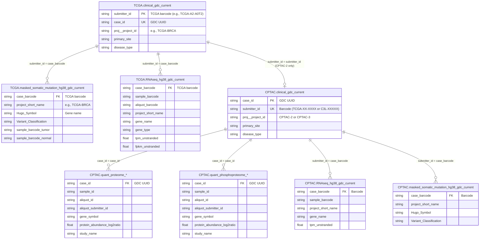
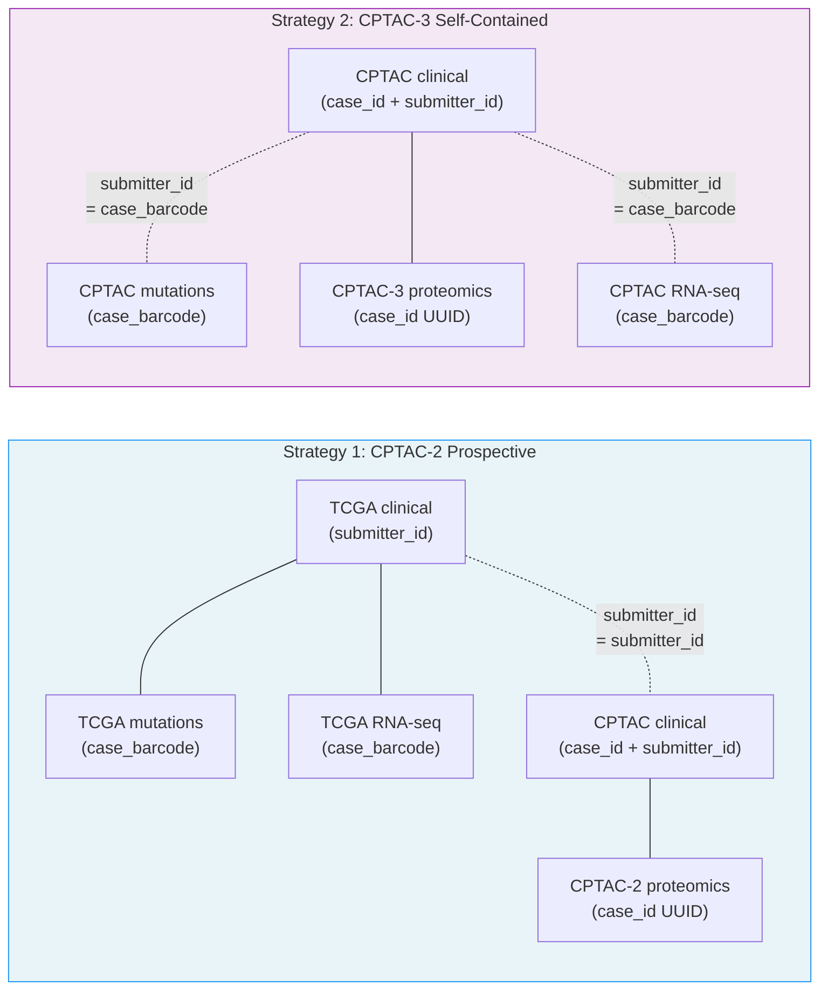

# Data Entity-Relationship Documentation

Living document tracking the relationships, join keys, and rules discovered across the TCGA and CPTAC datasets in BigQuery (`isb-cgc-bq`).

Last updated: 2026-03-06

---

## Identifier Systems

Two identifier formats coexist across all tables. Understanding which system each table uses is the single most important thing for writing correct joins.

| Format | Example | Origin | Used by |
|--------|---------|--------|---------|
| **TCGA barcode** | `TCGA-A2-A0T2` | Submitting project (TCGA/CPTAC) | ISB-CGC curated tables, clinical `submitter_id` |
| **GDC UUID** | `1f5e3f10-7f14-4b3a-...` | Genomic Data Commons | GDC-native tables, CPTAC proteomics `case_id` |

**Rule:** You cannot join a UUID to a barcode directly. Use a clinical table as a bridge (it has both).

---

## TCGA Barcode Hierarchy

TCGA barcodes encode a hierarchy. Each level adds characters:

```
TCGA-A2-A0T2        (case_barcode    = patient)
TCGA-A2-A0T2-01A    (sample_barcode  = tumor/normal sample from that patient)
TCGA-A2-A0T2-01A-11 (aliquot_barcode = physical portion sent to a lab)
```

- One patient can have multiple samples (e.g., primary tumor + metastasis + matched normal)
- One sample can have multiple aliquots (sent to different labs/platforms)
- Most analyses aggregate at the **case (patient) level**, but sample type matters (tumor vs. normal)

---

## Master ERD: Cross-Dataset Relationships



---

## Join Rules

### Rule 1: Same identifier system -- join directly
When both tables use the same format, join directly:
```sql
-- Both use barcodes
SELECT *
FROM TCGA.RNAseq_hg38_gdc_current r
JOIN TCGA.masked_somatic_mutation_hg38_gdc_current m
  ON r.case_barcode = m.case_barcode
```

### Rule 2: Different identifier systems -- bridge through clinical
When joining UUID tables to barcode tables, use clinical as a crosswalk:
```sql
-- Proteomics (UUID) to RNA-seq (barcode) via CPTAC clinical bridge
SELECT *
FROM CPTAC.quant_proteome_* p
JOIN CPTAC.clinical_gdc_current cc ON p.case_id = cc.case_id
JOIN CPTAC.RNAseq_hg38_gdc_current r ON cc.submitter_id = r.case_barcode
```

### Rule 3: Cross-dataset joins (TCGA <-> CPTAC) -- only CPTAC-2
CPTAC-2 prospective studies used the **same tumor samples** as TCGA. Their patients appear in both clinical tables with matching `submitter_id` barcodes. CPTAC-3 patients are independent and do NOT overlap with TCGA.
```sql
-- Cross-dataset: TCGA genomics + CPTAC-2 proteomics for same patient
SELECT *
FROM CPTAC.clinical_gdc_current cptac_cc
JOIN TCGA.clinical_gdc_current tcga_cc
  ON cptac_cc.submitter_id = tcga_cc.submitter_id
WHERE cptac_cc.proj__project_id = 'CPTAC-2'
```

---

## Column Name Mapping

The same concept has different column names depending on the table's origin:

| Concept | GDC-native tables | ISB-CGC curated tables | CPTAC proteomics (PDC) |
|---------|-------------------|------------------------|------------------------|
| Patient barcode | `submitter_id` | `case_barcode` | `aliquot_submitter_id` (partial) |
| Patient UUID | `case_id` | not present | `case_id` |
| Cancer type | `proj__project_id` | `project_short_name` | `study_name` |
| Gene | n/a | `Hugo_Symbol` / `gene_name` | `gene_symbol` |

---

## Cancer Type Naming Inconsistencies

TCGA and CPTAC use different abbreviations for the same cancers:

| Cancer | TCGA code | CPTAC code | Notes |
|--------|-----------|------------|-------|
| Lung squamous | LUSC | LSCC | |
| Head and neck | HNSC | HNSCC | |
| Kidney clear cell | KIRC | CCRCC | |
| Pancreatic | PAAD | PDA | |
| Uterine | UCEC | UCEC | Same |
| Lung adeno | LUAD | LUAD | Same |
| Glioblastoma | GBM | GBM | Same |

---

## Table Structure Patterns

### Sparse vs. Dense Tables

| Table type | Pattern | Rows per patient | Example |
|------------|---------|-----------------|---------|
| Mutations | Sparse | ~10 to ~1,200 (varies by cancer) | Only mutated genes get rows |
| RNA-seq | Dense | ~60,000-70,000 | Every annotated gene gets a row |
| Proteomics | Dense | ~10,000-12,000 | Every detected protein gets a row |
| Clinical | One row | 1 | One row per patient |

### CPTAC Table Naming Convention
```
quant_{molecular_type}_{study_design}_{cancer}_{lab}_{instrument?}_{source}_current
```
- **molecular_type:** proteome, phosphoproteome, acetylome, ubiquitylome, glycoproteome
- **study_design:** prospective (CPTAC-2), discovery (CPTAC-3), confirmatory (validation)
- **source:** pdc (Proteomic Data Commons)

---

## Integration Strategies Summary



- **Strategy 1** joins across TCGA + CPTAC for ~115-291 patients (breast/colon/ovarian). Same physical tumor samples. Most rigorous.
- **Strategy 2** stays within CPTAC for 100-257 patients per cancer type. Self-contained. More cancer types available.
- **Both strategies require the clinical table as a bridge** between UUID and barcode identifiers.
